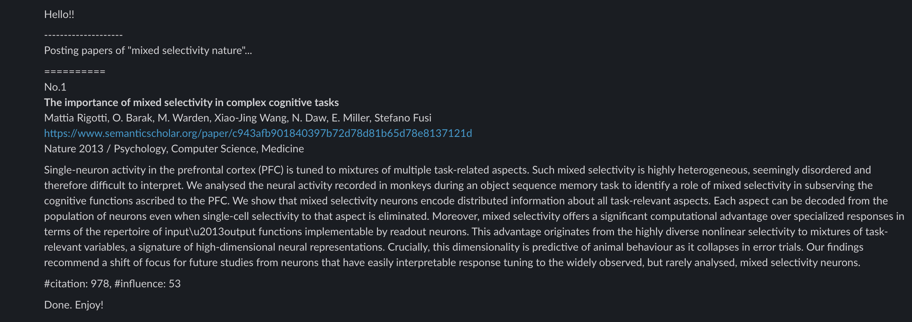

# 0. Summary
Using the Semantic Scholar API, this script, `SS_crawler.py` searches scientific papers with customized queries.
### Tested environments
- Mac OSX / RaspberryPi
- python 3.5

# 1. Quickstart
### (i)  One-shot execution  
Run once by providing arguments. The usage is:  

 `$ python SS_crawler.py -o -q your+favorite search+keywords -N 3 `

options:  
`-o`: one-shot option  
`-q`: Search query words concatenated with + sign. Queries must be separated with space.  
`-N`: Number of posted papers per search query  

### (ii) Periodic execution  
Simply omit the `-o` option to run periedically at the specified date and time.  
The best practice is to run the script on a network-connected server such as RaspberryPi (see 4. Recommended Usage for details).

 `$ python SS_crawler.py -q your+favorite search+keywords -N 3 `

To modify the date and time, change the variable `day_off` and `posting_hour` at the header of the `SS_crawler.py`. See 3. Details for more advanced options.

# 2. Background and Motivation
Semantic Scholar [1] is a machine-learning assisted publication search engine. The advantages of using the Semantic Scholar include but not limited to:  
- Search across journal/conference papers in addition to preprint servers (e.g., arXiv, bioRxiv, and PsyArXiv).  
- Each paper comes with a list of articles that are highly influenced (thus, highly related) by the paper.  
- Recent-updated Semantic Scholar API [2] provides an easy access to the search engine with a customized code.  

Utilizing these features, we can automatize the daily literature survey to find papers that are highly relevant to your work. I hope your research will benefit from the `SS_cralwer.py`.

# 3. Details   
To customize the script, modify the header part of the `SS_crawler.py` as follows.  

### 3-1. Modifying the default query list  
Find the vairable `query_list` in the header. Multiple queries can be specified. Words in a query must be concatenated with `+` signs. For example:  

`query_list = ('face+presentation+attack+recognition', 'sequential+probability+ratio+test')`  

### 3-2. Slack posting option  
By default, the `SS_crawler.py` outputs the search results to the console. To improve the readability and searchablility, the results can be posted on a personal Slack channel (or onto any url that you want) via a webhook whose address is specified with the variable `slack_url`. To get the webhook url, see [3].

### 3-3. Classic paper searching option  
In addition to searching with the default queries defined in the `query_list`, SS_crawler.py has an experimental function to find classic papers. Reading classic papers is educational: we can learn what papers have had what impact on future researches (and simply enjoyable). Semantic Scholar help visualizing the impact with the influential papers list, suitable for searching classics.  

To activate the classic paper searching option, set the `ifClassic` variable to `True` at the header. Currently the classic paper search is not supported on the one-shot execution.

Modify `classic_query_list` to define queries for classic papers. Instead of searching every query, one of the query from the `classic_query_list` will be randomly chosen for a search. I usually set queries more abstract than ones in `query_list`. To modify the range and time window, change the variable `range_classic`. The default is `np.arange(1935, 2025, 10)`: here, one of the 10-year time windows is randomly chosen to search papers within the time window. Hereafter, the papers searched with the `query_list` are referred as "regular papers" to be distinguished from classic papers.   

### 3-4. Change the default number of papers to be displayed  
Modify the variables `Npapers_to_display` and `Nclassic_to_display` for the regular and classic papers, respectively.  

### 3-5. Clear the search log  
SS_crawler saves the IDs of the papers that are already posted as `.pkl` files. The IDs of the regular papers and classic papers are saved as `published_ss.pkl` and `published_ss_old.pkl`, respectively. To clear the history, simply delete these files. If a specific paper ID must be deleted, the ID needs to be deleted from the `.pkl` file. Note that this function is adapted from the arXiv API crawler found at [4].  

# 4. Recommended Usage  
I usually connect a RaspberryPi to the Internet and run `SS_crawler.py` under Linux GNU screen so that closing terminal will not terminate the script. After installing the screen (e.g., with `apt` or `yum`), simply initialize a new screen with:  

`$ screen -S the_name_of_your_screen`

then run `SS_crawler.py`. For more details, see [5].

# 5. Example Result
`python3 SS_crawler_ver1.py -o -q -q mixed+selectivity+nature -N 1`  

  

# 6. References
[1] <a href='https://www.semanticscholar.org'>Semantic Scholar</a>  
[2] <a href='https://www.semanticscholar.org/product/api'>API | Semantic Scholar</a>  
[3] <a href='https://api.slack.com/messaging/webhooks'>Sending messages using Incoming Webhooks</a>  
[4] <a href='https://github.com/kushanon/oreno-curator/'>github.com/kushanon/oreno-curator</a>  
[5] <a href='https://www.gnu.org/software/screen/manual/screen.html'>Screen User's Manual</a>  
